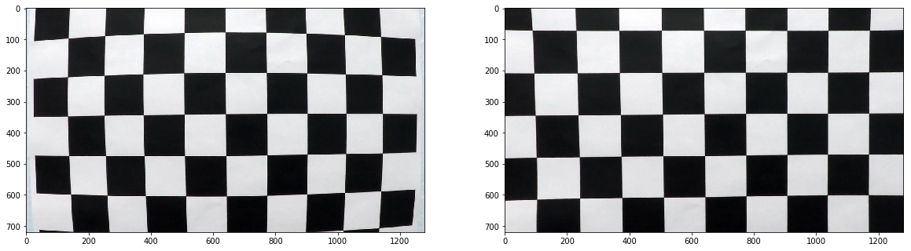
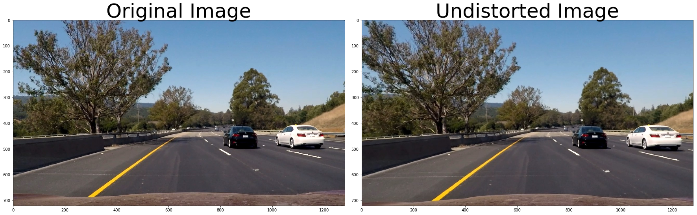
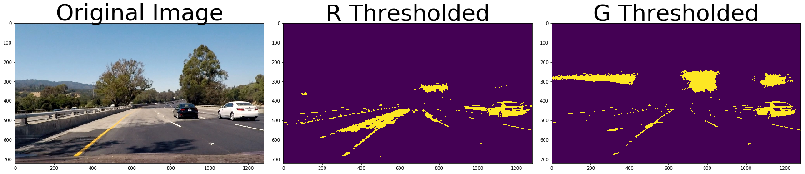
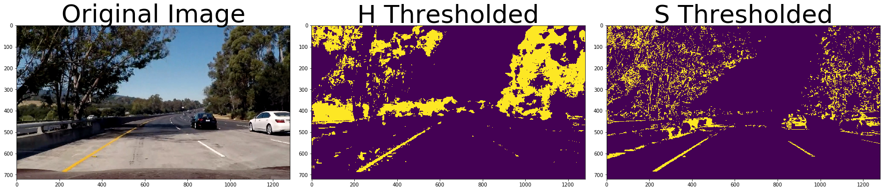
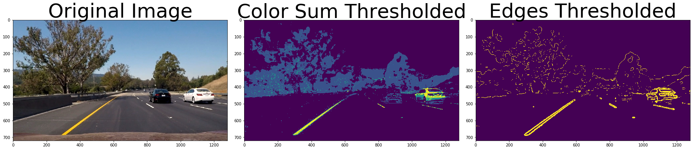
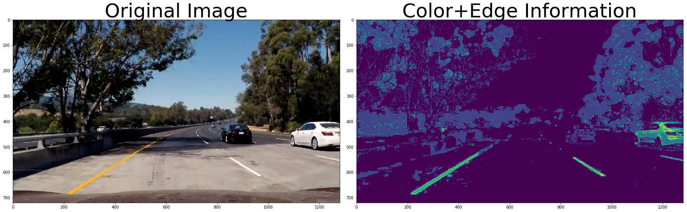
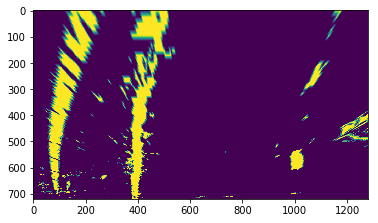
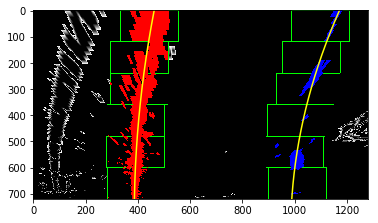

# Self-Driving Car Engineer Nanodegree

## Project: **Advanced Lane Finding**

The goals / steps of this project are the following:

* Compute the camera calibration matrix and distortion coefficients given a set of chessboard images.
* Apply a distortion correction to raw images.
* Use color transforms, gradients, etc., to create a thresholded binary image.
* Apply a perspective transform to rectify binary image ("birds-eye view").
* Detect lane pixels and fit to find the lane boundary.
* Determine the curvature of the lane and vehicle position with respect to center.
* Warp the detected lane boundaries back onto the original image.
* Output visual display of the lane boundaries and numerical estimation of lane curvature and vehicle position.

Rubric: [link](https://review.udacity.com/#!/rubrics/1966/view)

### Camera Calibration

All camera's image has some distortion. This step aims to correct the most common ones. The code use a chessboard image because we know the position of corners between the black and white (and easy to detect them). The "object points" are the corners (x, y, z) of the chessboard corners in the world. (The chessboard is expected to be flat!) The "imgage points" are the detected corners on the picture.

OpenCV function (`cv2.calibrateCamera()`) used to calculate the correction matrixes. This function runs only once to reduce runtime. 

### Perspective transformation

#### 1. Briefly state how you computed the camera matrix and distortion coefficients. Provide an example of a distortion corrected calibration image.

To easily calculate real life metrics we have to transform the camera image to "bird's eye view". An image is used where the lane is almost perfectly straight. A trapezoid is fit on the lane lines. An array with the desired rectangle's coordinate is defined. 

The coordinates are used by OpenCV function (`cv2.getPerspectiveTransform()`) to calculate the transformation and inverz transformation matrixes. This function runs only once to reduce runtime. 

### Pipeline (single images)

#### 1. Undistort input image

Using the matrixes from the camera calibration to undistort the input image.

#### 2. Collecting color and edge information

The lane markings are yellow and white. I use thresholding on the image in RGB and HLS color space. The R, G, H and S channels have the most useful information for this simple algorithm.

I combine these channels these channels. X and Y Sobel kernel used on this image. The gradient magnitude and direction are calculated and thresholded. The gradient results are added to the image with the color information. One last thresholding used to suppress noise (pixels with less than 2 hit from channel and gradient images) before the perspective transformaton.

Finally everything outside the Region of Interest is masked out.

#### 3. Perspective transform

The already calculated transformation matrix used on the output image of the previous step.

#### 4. Identify lane-line pixels and fit their positions with a polynomial

The lane is easily found close to the car on the perspective transformed image. I calculate a histogram on the bottom half of the image. The peaks are the lanes on the left and right of this histogram.

Non-zero pixels close(window) to the peak x positions assumed to be part of the lanes. A little further from the car we use the same window to assign pixels to lanes. The function optionally recalculate the window position. It continues until the whole height of the image is processed.

Now we have many pixel which describes the lanes. The function fits 2nd order polynomials on these pixels for both lane. (f(y) = A*y^2 + B*y + C)

A sanity check is done. (Except if the image is from the first frame.) If the lane width conforms to our expectation then the fitted lines are kept. In other cases the last good fitted lines used for the actual frame.

#### 5. Calculate the radius of curvature of the lane and the position of the vehicle with respect to center

Pixel per meter is derived from the lane marking size and distance.

Radius of fitted lines: The fitted 2nd order polinoms used in the curve radius formula. 

Distance from center: I assumed the camera is at the center of the car. The center of the lane can be calculated from the fitted 2nd order polinoms. Their difference is the result.

#### 6. Plot result to original image

If the sanity check is passed a green field is shown between the lines. If not then the field is red.

### Pipeline (video)

Pipeline class is defined because the fl_image function doesn't take functions with multiple parameters.

### Discussion

The pipeline has problems with edges which run parallel with the road. Pseudo findings are possible. More sanity check could be implemented. A moving average for the the estimated lanes would be also an improvement.

The algorithm use the color and gradient information inefficiently. The rubric required pixel counting but we lose information (pixel value) that way. I would prefer to use a pixel value weighted solution.

